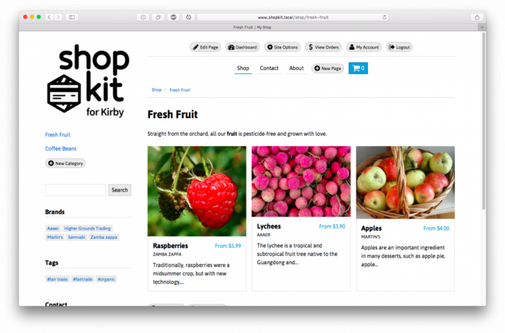

# Shopkit for Kirby

Shopkit is a comprehensive commerce solution for the excellent [Kirby CMS](http://getkirby.com).

A single-site license is $25 CAD. Bulk discounts available. Full details and documentation: <http://shopkit.samnabi.com>

## Features

### Shop settings

- Variants and options for each product (e.g. sizes and colours)
- Flexible shipping rules (flat rate, per item, by weight, or by total price)
- Related products
- Inventory control
- Discount codes
- Gift certificates
- Country-specific shipping & tax rates
- Built-in SEO (Schema.org data in RDFa format)
- Custom theme colours & background

### Payments & orders

- Use Square, Stripe Checkout, or PayPal Express ([or add your own payment gateway](https://shopkit.samnabi.com/docs/creating-your-own-payment-gateway))
- Track pending, paid, and shipped orders
- Send order notifications to your shipping manager
- Automatic PDF invoices

### Customer experience

- No sign-up required
- Responsive design for a great shopping experience on any device 
- Automatic language detection (English, French, German, and Spanish included by default)

## Pricing

You can try Shopkit for free on your test server, forever. Once you're satisfied, [buy a Shopkit license for $25 CAD](http://shopkit.samnabi.com) to use it on a public site.

Since Shopkit runs on the Kirby CMS, you'll also have to buy a [Kirby license](http://getkirby.com/license) from Bastian.

Shopkit also depends on some plugins whose authors you should support:

- [Multiselect](https://gumroad.com/l/kirby-multiselect) by Nico Hoffman
- [Snippetfield](https://github.com/jenstornell/kirby-snippetfield/issues/5) by Jens Törnell

## Install

Download the latest version of Shopkit from the [releases page](https://github.com/samnabi/shopkit/releases), or install with git:

    git clone --recursive https://github.com/samnabi/shopkit.git

### Sample content

To get a feel for the different features and product options, you might want to install the [sample content](https://github.com/samnabi/shopkit-sample-content). It has a few pre-populated categories and products ready to go, so you can dive right in.

## Update

Use these terminal commands to update Shopkit and its dependencies:

    git checkout master
    git pull origin master
    git submodule update --init --recursive

## Dependencies

An Apache or Nginx server running PHP 5.4+. Your PHP configuration must have the following extensions (most servers do):

- curl
- json
- mbstring
- dom
- gd

Shopkit also depends on these submodules:

- Kirby Core [2.5.10](https://github.com/getkirby/kirby)
- Kirby Panel [2.5.10](https://github.com/getkirby/panel)
- Stripe PHP SDK [v5.1.1](https://github.com/stripe/stripe-php)
- Square Connect SDK [2.0.2](https://github.com/square/connect-php-sdk)
- Multiselect field [2.1.1](https://github.com/distantnative/field-multiselect)
- Selector field [1.5.2](https://github.com/storypioneers/kirby-selector)
- Color field @[cbb4b16](https://github.com/ian-cox/Kirby-Color-Picker)
- Snippetfield @[49feb6f](https://github.com/jenstornell/kirby-snippetfield)
- WYSIWYG field @[d0e15f6](https://github.com/samnabi/kirby-wysiwyg)
- Tabs field @[8f86baa](https://github.com/afbora/Kirby-Tabs-Field)
- field-bidi @[6ce984e](https://github.com/samnabi/field-bidi)
- Stats @[4dff5ef](https://github.com/samnabi/kirby-stats)
- Dompdf [v0.6.1-446-g501ff6d](https://github.com/samnabi/dompdf)
    - php-font-lib @[b8af0ca](https://github.com/PhenX/php-font-lib)
    - php-svg-lib [v0.1](https://github.com/PhenX/php-svg-lib)

## Issues and feedback

Please report issues and request new features on the [issues page](https://github.com/samnabi/shopkit/issues), or send me an email: <sam@samnabi.com>

## Copyright

Shopkit © 2015-2018 Sam Nabi <http://samnabi.com>

Kirby © 2009-2018 Bastian Allgeier (Bastian Allgeier GmbH) <http://getkirby.com>