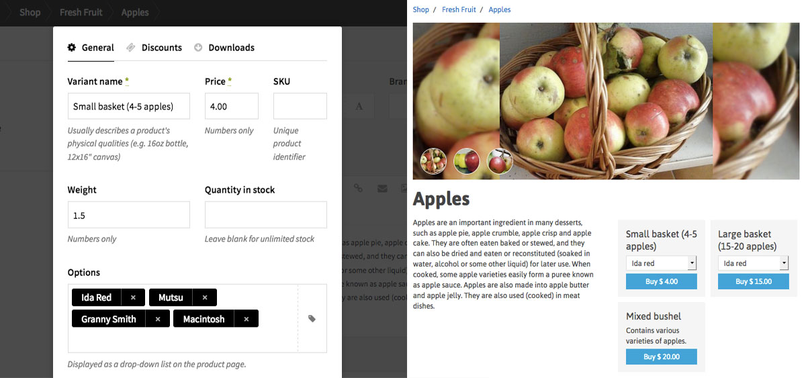

# Shopkit for Kirby

Shopkit is a comprehensive commerce solution for the excellent [Kirby CMS](http://getkirby.com).

A single-site license is $19 USD. Bulk discounts available. Full details and documentation: <http://shopkit.samnabi.com>

## Features

### Shop settings

- Variants and options for each product (e.g. sizes and colours)
- Flexible shipping rules (Flat rate, per item, by weight, or by total price)
- Related products
- Inventory control
- Discount codes and gift certificates (site-wide and product-specific)
- Product-specific shipping & tax exemptions
- Country-specific shipping & tax rates
- Built-in SEO for rich snippets
- Customize theme colours & background

### Payments & orders

- Process payments with PayPal and Stripe (modular folder structure lets you add other payment gateways)
- Let certain users pay later
- Manage pending, paid, and shipped orders
- Send order notifications to your shipping manager
- Automatic PDF invoices

### Customer experience

- No sign-up required
- Responsive design for a great shopping experience on any device 
- Browse products in a grid or slideshow
- Beautiful search layout
- Automatic language detection (English, French, German, and Spanish included by default)

## Pricing

You can try Shopkit for free on your test server, forever. Once you're satisfied, [buy a Shopkit license for $19 USD](http://shopkit.samnabi.com) to use it on a public site.

Since Shopkit runs on the Kirby CMS, you'll also have to buy a [Kirby license](http://getkirby.com/license) from Bastian.

Moral licenses for [Snippetfield](https://www.paypal.me/DevoneraAB) and [Multiselect](https://gumroad.com/l/kirby-multiselect), two of Shopkit's dependencies, are recommended.

## Install

Download the latest version of Shopkit from the [releases page](https://github.com/samnabi/shopkit/releases), or install with git:

    git clone --recursive https://github.com/samnabi/shopkit.git

### Sample content

To get a feel for the different features and product options, you might want to install the [sample content](https://github.com/samnabi/shopkit-sample-content). It has a few pre-populated categories and products ready to go, so you can dive right in.

## Update

Use these terminal commands to update Shopkit and its dependencies:
    
    # Update Shopkit
    git checkout master
    git pull origin master

    # Update dependencies
    git submodule update --init --recursive

## Dependencies for Shopkit v2.0-dev

Your server's PHP configuration must include the following extensions:

- curl
- json
- mbstring
- dom
- gd

Shopkit depends on these submodules:

- Kirby Core [2.4.1](https://github.com/getkirby/kirby/tree/2.4.1)
- Kirby Panel [2.4.1](https://github.com/getkirby/panel/tree/2.4.1)
- Stripe PHP SDK [v4.7.0](https://github.com/stripe/stripe-php)
- Multiselect field [2.1.0](https://github.com/distantnative/field-multiselect/tree/2.1.0)
- Selector field [v1.5.2](https://github.com/storypioneers/kirby-selector/tree/v1.5.2)
- Color field @[fcda14d1ae](https://github.com/ian-cox/Kirby-Color-Picker/tree/fcda14d1ae655870590775a744543a6e40a06ce2)
- Snippetfield @[a5808fb217](https://github.com/samnabi/kirby-snippetfield/tree/a5808fb2173a54b81d22c02618856ad408604cfa)
- WYSIWYG field @[d0315f6](https://github.com/samnabi/kirby-wysiwyg)
- Tabs field @[ad7a7d3c9e](https://github.com/afbora/Kirby-Tabs-Field/tree/ad7a7d3c9e667e33dae292e34c3178eb29983556)
- field-bidi @[6ce984e85a](https://github.com/samnabi/field-bidi/tree/6ce984e85afa191d60fb3d7a18218571f7501731)
- Stats @[4dff5ef](https://github.com/samnabi/kirby-stats)
- Dompdf @[aba268bdeb](https://github.com/samnabi/dompdf/tree/aba268bdebc6e50383fd6758778a4d77ca810c85)
- php-font-lib @[b8af0cacdc](https://github.com/PhenX/php-font-lib/tree/b8af0cacdc3cbf1e41a586fcb78f506f4121a088)
- php-svg-lib [v0.1](https://github.com/PhenX/php-svg-lib/tree/v0.1)

## Issues and feedback

Please report issues and request new features on the [issues page](https://github.com/samnabi/shopkit/issues), or send me an email: <sam@samnabi.com>

## Copyright

Shopkit © 2015-2017 Sam Nabi <http://samnabi.com>

Kirby © 2009-2017 Bastian Allgeier (Bastian Allgeier GmbH) <http://getkirby.com>